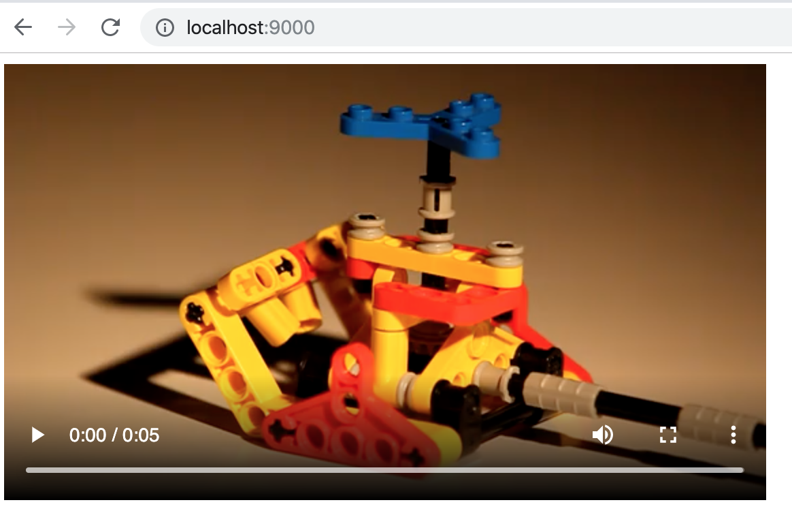
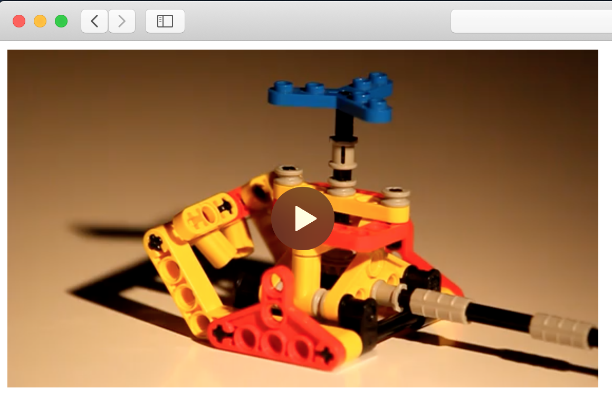

# Prevent user download video from browser (HTML5, PHP)

Tested on Chrome 102.0.5005.61 (Official Build) (x86_64), Safari  15.4 (17613.1.17.1.13)

## Prequisition
- PHP 8.4.8 or higher
- PSR-12 compliance

## How to use
 - Download this code and extract all files
 - Open index.php

### License
MIT License.

### Original from

- [Defa-Protector-Protect-HTML5-Video-From-Download](https://sourceforge.net/projects/defaprotecthtml5videodownload/files/latest/download) Made with Love From Juthawong Naisanguansee , Bangkok - Thailand http://www.ampareengine.com

### Solution from

- [Han Lin Yap - gist:3906826](https://gist.github.com/codler/3906826)